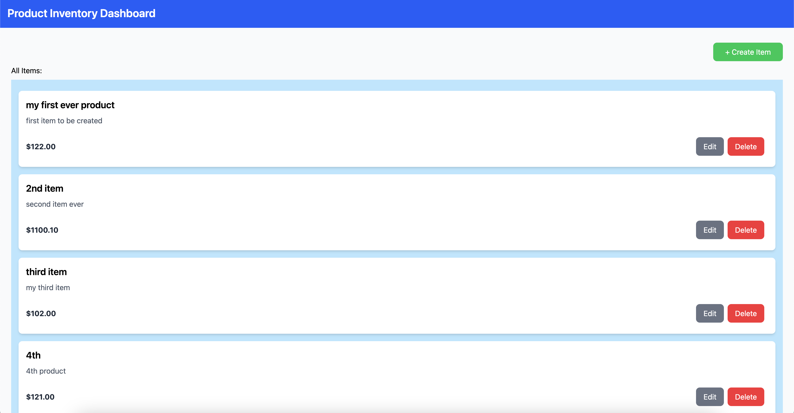

# Arkmind-assessment

## Overview

This is a full-stack single page item management application built with React (Vite), Redux Toolkit, TypeScript, Express.js, and MySQL. It allows users to create, view, edit, and delete items in real-time using Redux for state management.

## Getting Started 
1. Run ``` git clone git@github.com:kclim1/arkmind-assessment.git```
2. cd into arkmind-assessment
3. Run ```npm install ``` in the root folder
<br>
NOTE : Make sure you've also installed all dependencies in frontend and backend before using npm start in the root folder. Instructions on how to setup frontend and backend can be found in their respective folders. Also ensure you alredy have mySQL installed. 
4. Login to your mySQL and then 
5. Run ```npm start```

## Tech Stack

Frontend: React, Redux Toolkit, TypeScript, TailwindCSS, Axios

Backend: Express.js, TypeScript, MySQL , Sequelize

State Management: Redux Toolkit

API Communication: RESTful API with Axios

Notifications: Sonner 

## Folder Structure 
```
📦 arkmind-assessment
├── backend
│   ├── src
│   │   ├── controllers
│   │   │   ├── mainController.ts
│   │   ├── models
│   │   │   ├── config.ts
│   │   │   ├── itemModels.ts
│   │   ├── routes
│   │   │   ├── itemRoutes.ts
│   │   ├── validators
│   │   │   ├── validateItem.ts
│   │   ├── server.ts
│   ├── package.json
│   ├── tsconfig.json
│   ├── .env
│
├── frontend
│   ├── src
│   │   ├── components
│   │   │   ├── CreateItemButton.tsx
│   │   │   ├── CreateItemForm.tsx
│   │   │   ├── DeleteConfirmationButton.tsx
│   │   │   ├── ItemCard.tsx
│   │   │   ├── ItemDisplayContainer.tsx
│   │   ├── store
│   │   │   ├── hooks.ts
│   │   │   ├── store.ts
│   │   │   ├── slices
│   │   │   │   ├── createItemFormSlice.ts
│   │   │   │   ├── deleteModalSlice.ts
│   │   │   │   ├── itemDetailsSlice.ts
│   │   ├── utils
│   │   │   ├── useFetchAllItems.ts
│   │   ├── Dashboard.tsx
│
├── .gitignore
├── README.md
```
## Features
1. Create Items 
2. Edit Items
3. Delete Items
4. View All Items

## Preview of app 


